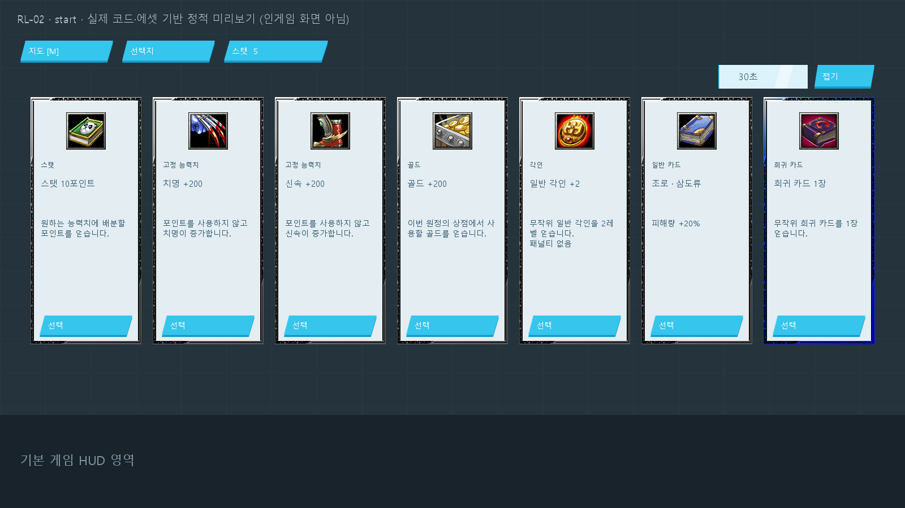
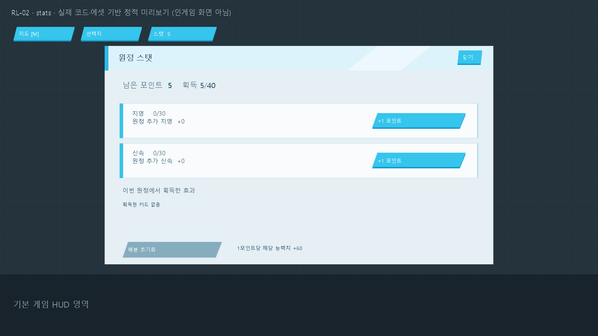

# RL-02 원정 UI 수정

RL-01의 한 창에 모인 선택·상점·스탯을 각각 분리했다. 최신 시험 맵은 `ARCRPG_RL_02.w3x`이며 원정 콘텐츠 범위와 보상·배분·저장 규칙은 RL-01과 같다.

## 화면 변경

- M은 현재 경로와 위치를 확인하는 지도만 연다.
- 영웅 선택 후 출발 준비 창을 표시한다. 시작/개인 보상/사건/상점은 해당 단계에 자동으로 열리고 선택을 확정하면 닫힌다.
- 시작 후보 7개, 개인 보상 3개를 테두리·아이콘·효과·선택 버튼이 있는 카드로 표시한다. 카드 전체를 누를 수 있고 마우스를 올리면 강조된다.
- 스탯 배분과 획득 효과는 별도 `스탯` 버튼으로 연다. 스탯 포인트를 받는 보상 후보는 선택창에 유지한다.
- 화면 상단의 단계·라이프·선택 안내 문구와 하단의 시험판 설명을 제거했다. 선택 제한시간은 해당 창 내부, 전투 진행 정보는 지도 내부에 표시한다.
- 접기/닫기/ESC 이후에도 현재 후보를 유지하며 `선택지` 또는 `상점` 버튼으로 다시 열 수 있다.
- 기존 강화 UI의 밝은 패널, 청록색 버튼, 파란 글자, 마우스 강조 텍스처를 사용한다. 강화창이 열려 있으면 원정 창을 숨긴다.
- 원정 중 마을 퀘스트 안내가 겹치지 않게 숨기고, 마을에서 창을 닫으면 기존 단계대로 복원한다.
- 전장 장식을 숨기는 `MapResetAll` 뒤에 누락됐던 `MapSet(ExpArena, 1)`을 연결했다. 실제 배경 표시 복원은 인게임 확인이 필요하다.

## 소스와 리소스

| 파일 | 역할 |
|---|---|
| `UI_ExpeditionCommon.j` | 공통 스타일, 창 전환, 현재 화면 버전이 포함된 동기화 요청 |
| `UI_ExpeditionChoice.j` | 준비, 카드 선택, 사건, 상점, 결과 |
| `UI_ExpeditionStats.j` | 별도 스탯 배분 및 획득 효과 |
| `UI_Map.j` | M 지도, 기존 영웅 선택 진입점 연결 |
| `assets/expedition/import-manifest.json` | 선택 프레임 원본 및 강화 UI 텍스처 경로와 SHA-256 |

J2B 참고 맵에서 추출한 `UI_Select_White/Blue/Purple/Orange/Colorful.blp` 원본 5개를 이름만 `UI_Expedition_*`로 바꿔 넣었다. 등급은 노말 흰색, 레어 파란색, 에픽 보라색, 프리즘 다색을 사용한다. 주황 원본은 보관하며 현재 4등급에는 사용하지 않는다. 밝은 강화 패널을 테두리 안에 겹쳐 사용하고 원본 이미지 자체는 수정하지 않았다.

교체 전 UI는 `copy_archive/roguelite_2026-09-19/rl01_ui_before_split/UI/UI_Map.j`에 보관했다. 활성 import에는 포함하지 않는다. 기존 장비/카드부여/엘릭서 강화 화면과 SaveLoad 구현은 이번 수정 대상이 아니다.

## 검증

| 구분 | 결과 |
|---|---|
| 정적 검사 | 활성 import 156개 존재, 보관 폴더 미포함, 보관본 내용 일치, 변경분 공백 검사 통과 |
| 진행 모의 검사 | `node tools/check-expedition.cjs` 27개 시나리오 묶음 통과 |
| UI 모의 검사 | `node tools/check-expedition-ui.cjs` 10개 묶음 통과. 실제 JASS 콜백의 클릭/전환/강조, 버전 검사, 독립 스탯, 상점 비활성화, 개인별 완료, 퀘스트 숨김/복원 포함 |
| 빌드/컴파일 | JassHelper/PJass 종료 코드 0. 기존 기준선의 `24 errors ignored` 출력은 남아 있으므로 무시 오류 0개라는 뜻은 아님 |
| 전달 검사 | 원본 자동 생성 함수 17개, 기존 MPQ 파일 2,380개 내용 보존. 스크립트·import 목록 교체 및 UI 리소스 14개 해시 검증. 상세 결과는 `RL-02-build-report.json` |
| 시각 검사 | 실제 JASS 좌표/텍스트와 원본 텍스처를 사용한 정적 미리보기에서 시작/보상/상점/스탯/지도 배치와 글자 영역 점검. Warcraft 렌더링 검사는 아님 |
| 미수행 | 실제 Warcraft 클릭·해상도별 표시·전장 배경, 멀티플레이 동기화, 서버 저장/재접속 |

원본 `ARCRPG.w3x`와 이전 `ARCRPG_RL_01.w3x`의 SHA-256은 변경 전과 같다. RL-02 SHA-256은 `6498e999fed2261066bad9fbd1bca80902b6f42bfd24f2432a174e2fe09d1a1b`다.

## 다음 인게임 확인

현재 JN 환경에서 `Maps/mm/2/ARCRPG_RL_02.w3x`를 실행한다. 영웅 선택 → 원정 준비 → 카드 위에 마우스를 올리고 한 개 선택 → 스탯 배분 → M 지도 순서로 확인한다. 카드 전체 클릭, 상단 문구 제거, 스탯 분리, 전장 바닥 표시를 먼저 확인한다.

## 정적 미리보기

게임 실행 화면이 아니다. 모의 프레임에서 기록한 실제 코드 좌표와 적용 텍스처로 그렸다. 글꼴 렌더링과 마우스 입력은 실제 게임에서 차이가 있을 수 있다.

