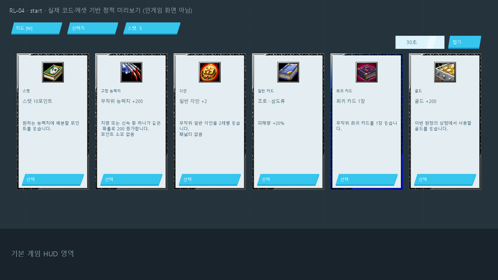
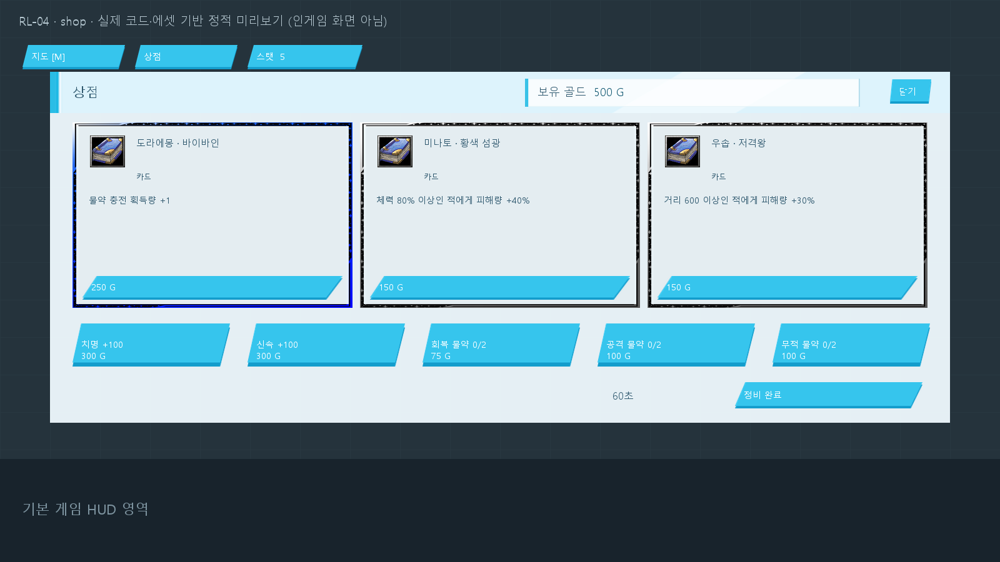
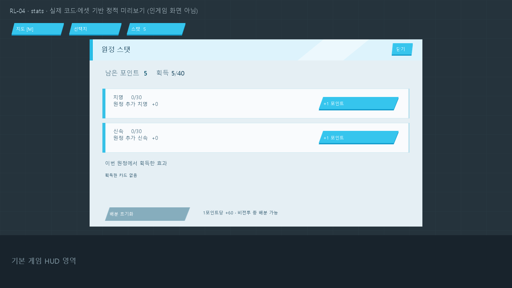

# RL-04 시작 선택·상점 표시·스탯 배분 수정

시험 맵은 `Maps/mm/2/ARCRPG_RL_04.w3x`다. RL-03의 BACKDROP 활성화 호출 제거를 유지한다.

## 변경

- 시작 선택을 7개에서 6개로 줄였다. 순서는 스탯 10포인트 → 무작위 능력치 +200 → 일반 각인 +2 → 일반 카드 → 희귀 카드 → 골드 +200이다. 기존 두 고정 능력치 후보를 합쳤으며 배분용 10포인트 후보는 유지한다.
- 무작위 능력치는 선택 확정 시 치명 또는 신속 중 하나만 각각 50% 확률로 200 증가한다. 동기화 수신부에서 한 번 추첨하며 배분 포인트는 소모하지 않는다.
- 상점 제목과 분리된 보유 골드 영역을 추가했다. 구매 직후 잔액을 갱신하고 카드·능력치·물약에 골드 부족, 구매 완료, 한도 도달을 표시한다. 상품 가격과 구매 제한은 유지한다.
- 스탯 배분은 시작·이동·투표·보상·상점에서 허용한다. UI 활성화와 동기화 수신부가 같은 `ExpCanAllocate` 조건을 사용한다. 전투 중 변경은 계속 차단한다.
- 포인트 없음, 능력치별 최대 30포인트, 전투 중 배분 불가를 화면에 표시한다.

## 버튼 문제의 확인 범위

사용자는 상점과 스탯 버튼에 마우스를 올려도 색이 바뀌지 않는다고 보고했다. 기존 코드에서 이동·투표 중 스탯 버튼이 비활성화되고, 골드 부족 상품도 사유 없이 비활성화되는 경로를 확인했다. 시작 골드가 0이며 일반 전투 승리 보상이 100골드인 반면 카드 가격은 최소 150골드, 능력치는 300골드여서 이 상태를 실제 진행에서도 만날 수 있다.

이번 변경은 확인된 비활성화 조건과 부족한 표시를 수정한다. 유효한 클릭 요청에 따른 스탯 증가·구매 처리는 실제 JASS 함수를 모의 실행해 확인했다. 실제 Warcraft에서 잔액과 포인트가 충분한 버튼까지 마우스 이벤트를 받지 못하는지는 재현하지 못했다. 따라서 네이티브 입력 문제 전체를 해결했다고 확정하지 않는다.

## 검증

| 구분 | 결과 |
|---|---|
| 정적 검사 | 변경분 공백 검사, 선택 순서와 action 매핑, 배분 허용 조건 대조 |
| 진행 모의 검사 | `node tools/check-expedition.cjs` 28개 묶음 통과. 무작위 두 결과, 중복 확정 차단, 기존 7번 무효화 포함 |
| UI 모의 검사 | `node tools/check-expedition-ui.cjs` 12개 묶음 통과. 비전투 5개 상태의 배분·초기화, 포인트·한도·전투 제한, 상점 구매 콜백·잔액·부족 사유 갱신 포함 |
| 빌드/컴파일 | JassHelper/PJass 종료 코드 0. 기존 기준선의 `24 errors ignored` 출력은 남음 |
| 전달 검사 | 기존 MPQ 멤버 2,380개와 자동 생성 함수 17개 보존, UI 리소스 14개 해시 확인. `RL-04-build-report.json` 참조 |
| 시각 검사 | 실제 코드 좌표와 적용 리소스로 만든 시작·상점·스탯 정적 미리보기 검토. 텍스트 높이 초과 경고 없음 |
| 미수행 | 실제 Warcraft 로딩·마우스 입력·해상도별 표시, 멀티플레이, 서버 저장 |

RL-04 SHA-256은 `d61974fab2b67086802098bc60c62acd8093cd78847914d014dc2c53a5ed0161`이다. 원본과 RL-01~03은 유지한다.

## 다음 인게임 확인

1. RL-04에서 시작 후보가 6개이며 마지막이 골드인지 확인한다.
2. 골드 +200을 선택하고 투표 화면에서 스탯 창을 열어 치명·신속 +1을 누른다. 남은 포인트가 줄고 해당 수치가 증가해야 한다.
3. 상점에서 보유 골드와 가격을 확인한다. 구매 가능한 회복 물약을 누르면 충전과 잔액이 즉시 갱신되어야 한다.

포인트나 골드가 충분하고 버튼이 청록색인데도 강조·클릭이 없다면 해당 화면과 맵 버전을 기준으로 입력 계층을 추가 조사한다.

## 정적 미리보기

실제 게임 실행 화면이 아니다.

