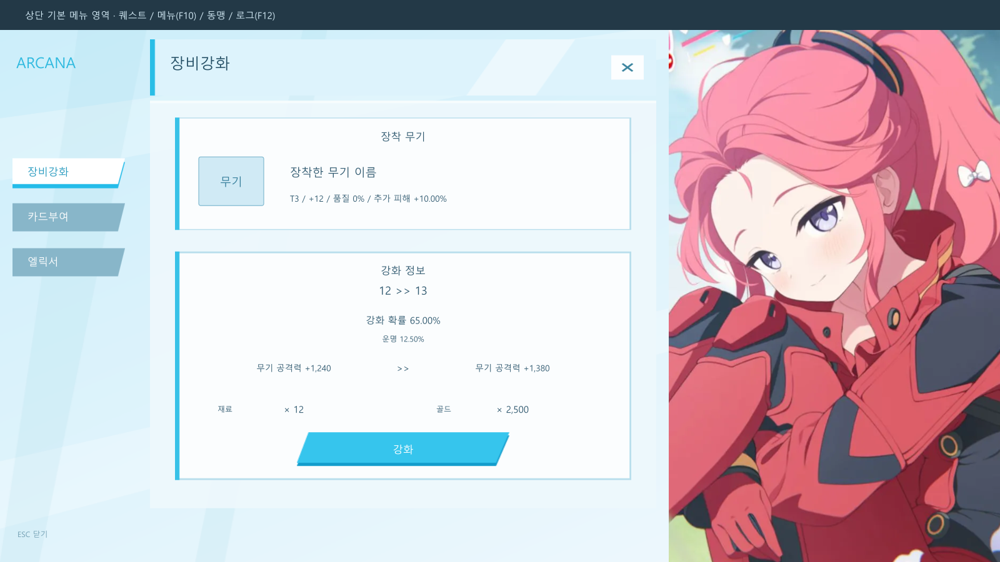
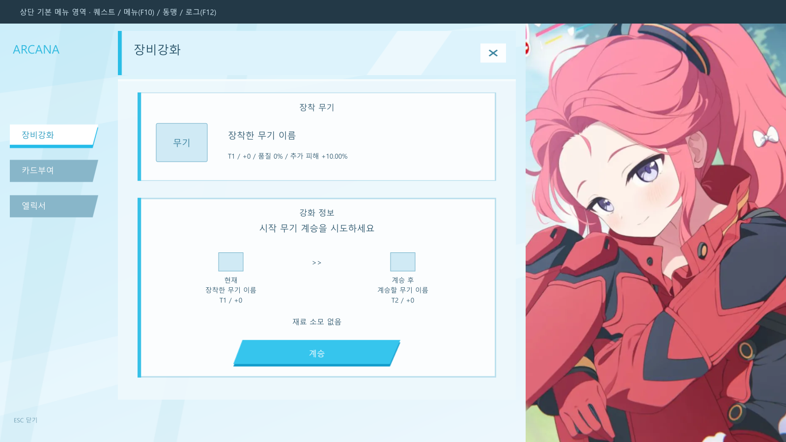

# ARCANA-2 강화 UI

장비강화 NPC 클릭 또는 `-강화`로 여는 JN/Dz 강화 허브입니다. `-upgrade`도 유지합니다. 캐릭터 선택 후 사용할 수 있습니다.

디자인은 [GameKee의 유즈 임전 페이지](https://www.gamekee.com/ba/690661)의 밝은 청색 배경, 사선 탭, 흰색 패널과 우측 인물 구성을 참고했습니다. 장비강화, 카드부여, 엘릭서 탭과 현재 탭 제목을 표시합니다. 무기 탭은 장착 슬롯에서 이름, 아이콘, 티어, 품질, 강화 단계, 확률, 운명 수치와 재료를 읽습니다. 빈 무기는 안내를 표시하고 실행 버튼을 숨깁니다. 강화·계승의 재료 소모, 확률, 저장 및 동기화 계산은 기존 것을 유지합니다.



미리보기의 무기·재료 표시는 설명용이며 수치는 예시입니다. 실제 Warcraft III 실행 화면이 아닙니다. 게임에서는 기존 아이템 아이콘과 실시간 수치를 사용합니다.

## 장비 정보와 간격 개선

계승 전후 아이콘 아래에 현재/계승 후, 아이템 이름, 티어와 강화 단계를 표시합니다. 이름과 티어는 기존 계승 대상 아이템에서 읽으며 계승 후 강화 단계는 기존 처리와 같은 +0입니다. 아이템 이름의 등급 색상 뒤에는 짙은 글자색을 다시 적용해 티어가 흰 배경에 묻히지 않도록 했습니다.

무료 계승에서는 빈 재료 아이콘과 x 0 대신 `재료 소모 없음`을 표시합니다. 일반 강화도 필요한 재료 또는 골드가 0이면 해당 아이콘을 숨기고 소모 없음 안내를 표시합니다. 재료가 필요한 단계로 바뀌면 아이콘과 수량을 다시 표시하며, 계승 재료 아이콘은 실제 소모 처리의 티어별 재료와 맞춥니다. 상단 품질은 툴팁과 동일하게 내부 품질 단계 × 5의 백분율로 표시합니다.

중앙 정보 패널 높이를 0.290에서 0.244로 줄이고 실행 버튼을 0.042만큼 위로 옮겼습니다. 신규 텍스처 가져오기는 필요하지 않습니다. 이미 이전 강화 UI를 적용한 맵은 `UI/UI_Enchant.j`를 반영하고 맵을 저장·컴파일한 뒤 지도 시험을 새로 시작합니다.



이 개선은 정적 코드 비교와 JassHelper/PJass 컴파일을 확인했으며, 강화·무료 계승의 정적 미리보기를 검토했습니다. 실제 게임에서는 무기 없음, 무료 계승, 유료 계승, 재료/골드가 0인 강화, 일반 강화, 최대 단계 및 탭 재진입을 확인해야 합니다. 게임 실행과 수정 후 화면 검증은 사용자가 진행합니다.

## 적용

1. PR의 스크립트 파일을 모두 같은 상대 경로에 반영합니다. `UI_Upgrade.j`와 `UI_Enchant.j`만 복사하면 공통 UI 숨김이 적용되지 않습니다. `Import.j`에는 이미 이 라이브러리들의 import가 있으므로 추가 라이브러리 등록은 필요 없습니다.
2. `war3mapImported/UI_Upgrade_*.tga` 11개를 맵 가져오기 관리자에 추가합니다. 기본 사용자 지정 경로 `war3mapImported\파일명.tga`를 유지합니다. 정확한 목록은 `assets/upgrade/import-manifest.json`에 있습니다.
3. 기존 맵의 `Templates.toc`, 기본 아이템 아이콘과 카드·엘릭서 리소스는 그대로 필요합니다. 이 패키지는 현재 저장소와 맵의 기존 시스템에 통합하는 변경입니다.
4. 현재 에디터의 JN 라이브러리를 사용해 맵을 저장·컴파일합니다. `Import.j`의 절대 경로가 실제 저장소 위치와 일치해야 합니다.
5. 지도 시험 후 캐릭터를 만들고 NPC 클릭과 `-강화`, 탭 전환, 강화·계승, 닫기와 ESC를 확인합니다.

맵의 W3X 파일 자체는 이번 변경에 포함하지 않습니다. 가져오기와 맵 저장을 완료해야 게임에서 새 텍스처가 표시됩니다.

## UI 표시와 복원

`Library/FrameCount.j`의 `GetGameplayUI()`가 커스텀 게임 UI의 공통 부모입니다. 기존 생성 지점의 부모만 바꾸어 퀘스트, 인벤토리, 스킬 HUD, 보스 표시, 캐릭터 아덴 및 연출이 이 부모에 속하게 했습니다. 강화 허브와 공용 아이템 툴팁은 별도로 둡니다. 캐릭터 선택 UI는 변경하지 않습니다.

강화 화면을 열면 공통 부모, 미니맵, 초상화와 네이티브 정보 패널을 숨기며, HP 표시 상태를 저장합니다. 자식 프레임을 타이머가 다시 표시하더라도 숨겨진 부모 아래에 머무릅니다. 닫을 때 부모와 네이티브 HUD를 복원하며 HP는 저장했던 상태로 복원합니다. ESC는 기존의 다른 창 닫기 정책도 그대로 실행합니다. 상단의 퀘스트·메뉴·동맹·로그 버튼에는 숨김을 적용하지 않고, 허브 상단은 좌표 `0.568` 아래에 둡니다. 게임 진행 자체는 멈추지 않습니다.

카드 탭은 기존 `StoneStart`의 재료 확인·소모 동작을 재사용합니다. 같은 세션에서 준비한 카드는 탭을 왕복해도 다시 소모하지 않습니다. 재료 또는 빈 공간이 없으면 허브 안에 안내합니다.

## 텍스처와 제작 소스

모든 신규 텍스처는 비압축 32비트 BGRA TGA이며 크기는 2의 거듭제곱입니다. 배경과 인물 1024×1024, 본문 512×512, 제목 512×128, 카드 512×256, 탭·강화 버튼 256×64, 닫기 64×64입니다. 전체 배경은 불투명하여 뒤의 게임 화면이 비치지 않습니다.

패널과 탭의 편집 가능한 SVG, 인물 원본, 미리보기와 가져오기 목록은 `assets/upgrade`에 있습니다. 인물 텍스처는 [Game8 유즈(임전) 페이지](https://game8.jp/blue-archive/760857)의 메모리얼 로비 원본 WebP(1920×1080)를 사용하는 `portrait-source.webp`로 교체했습니다. 다운로드 주소와 해시는 `portrait-source.json`에 기록했습니다. 이전 사용자 제공 JPG는 참고 자료로 남겨두며 빌드에는 사용하지 않습니다. AI 생성이나 업스케일링 모델은 사용하지 않았습니다.

새 원본의 (800, 70)에서 622×1000픽셀을 크롭해 비압축 1024×1024 TGA로 변환합니다. 이전 크롭은 348×560픽셀이었습니다. TGA 파일 자체는 정사각형이지만 기존 JASS 인물 프레임이 화면의 세로 비율로 표시하므로 16:9에서 인물 비율이 유지됩니다. 같은 장면의 다른 애니메이션 순간으로 표정과 고개 각도는 약간 다릅니다. 4:3 및 다른 화면 비율은 게임에서 별도 확인이 필요합니다.

인물 화질 교체만 적용할 때는 `war3mapImported\\UI_Upgrade_Portrait.tga` 경로의 텍스처 한 개를 덮어 가져오고 맵을 저장한 뒤 지도 시험을 새로 시작합니다. JASS 수정은 없습니다. 파일 크기는 약 2 MiB에서 4 MiB로 늘었습니다. TGA 형식·픽셀 바이트 수·가져오기 목록과 다른 텍스처가 변경되지 않았음을 확인하고, 실제 표시 크기의 교체 전후 이미지와 정적 UI 미리보기를 검사했습니다. 이번 자산 교체에 대한 맵 컴파일·게임 런타임 검증은 미실시입니다.

Node.js와 `sharp`가 있는 환경에서 아래 명령으로 재생성할 수 있습니다. `SHARP_PATH` 환경 변수로 설치된 `sharp` 경로를 지정할 수도 있습니다.

```powershell
node tools/build-upgrade-assets.cjs
node tools/preview-upgrade.cjs
```

## 검증 기록

- 정적 분석 완료. NPC·채팅·ESC 연결, 반복 열기 방어, 로컬 플레이어 처리, 공통 부모와 탭 콘텐츠의 분리를 확인했습니다. `ButtonEnchant`와 `ButtonSuccess` 본문은 텍스트 표시 helper 이름을 제외하면 main과 동일함을 비교했습니다.
- 빌드·컴파일 완료. 현재 에디터의 `logs/inputwar3map.j`에서 현재 저장소 import를 다시 읽어 Vexorian JassHelper `--scriptonly`로 생성했습니다. JassHelper 종료 코드 0, 생성된 69,079줄의 JASS에 대한 PJass 종료 코드 0을 확인했습니다. `24 errors ignored`는 해당 PJass가 출력한 비치명적 알림이며 Parse successful입니다. 맵 전체 패키징은 하지 않았습니다.
- 배포 파일 검사 완료. 참조된 신규 TGA 11개 전부의 존재, 크기, 형식, 픽셀 바이트 수와 경로를 검사했고 `git diff --check`를 통과했습니다.
- 시각 검사 완료. TGA를 읽어서 실제 배치 좌표에 조합한 1600×900 정적 미리보기를 확인했습니다.
- 런타임 시험 미실시. 실제 게임에서의 프레임 생성, 입력·툴팁, 모든 캐릭터의 아덴 복원, 멀티플레이 로컬 UI 분리, 장비 거래, 상단 메뉴 조작과 화면 비율별 검증은 남아 있습니다.
